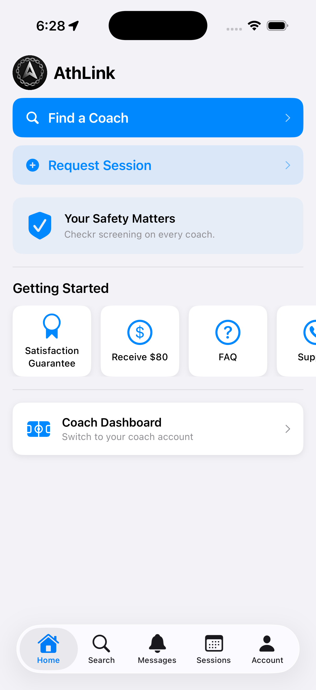
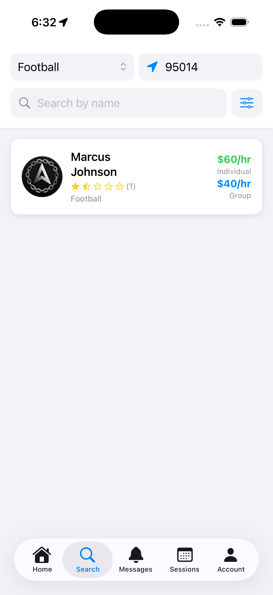
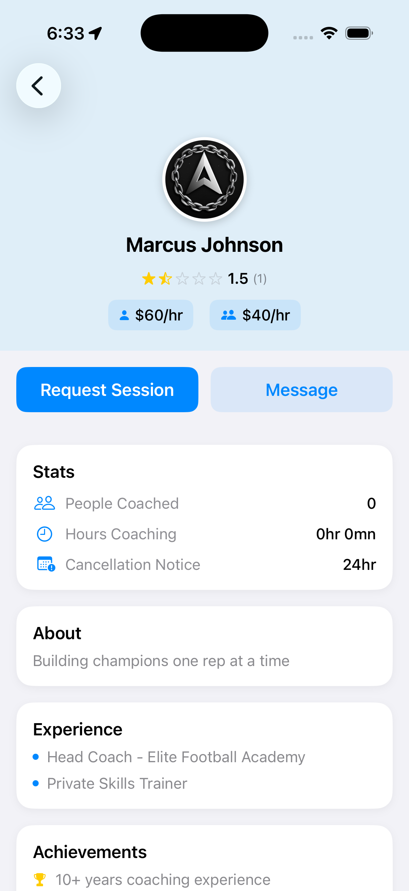
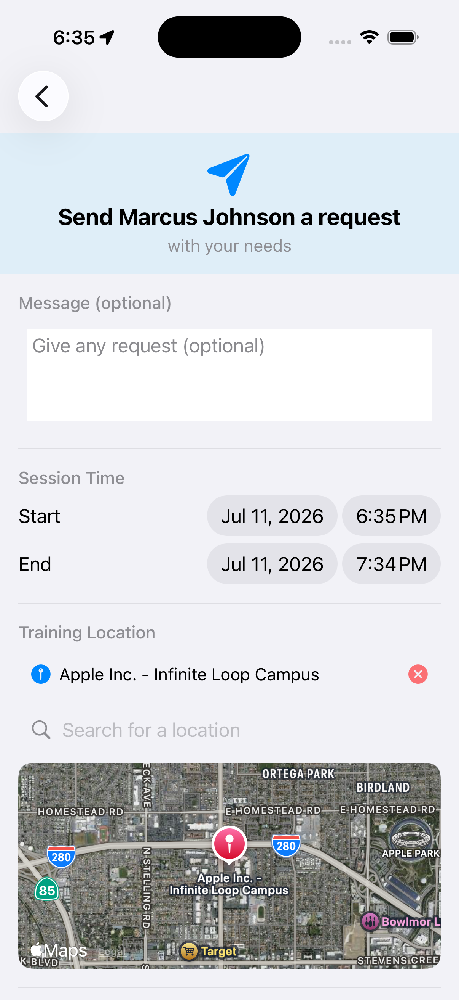
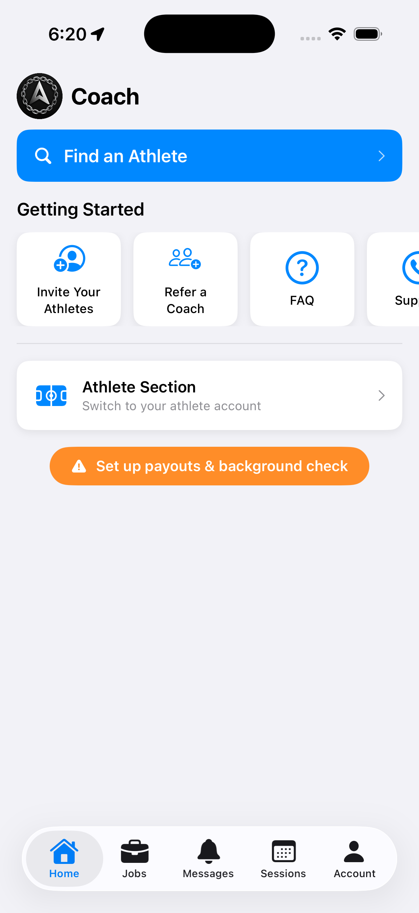
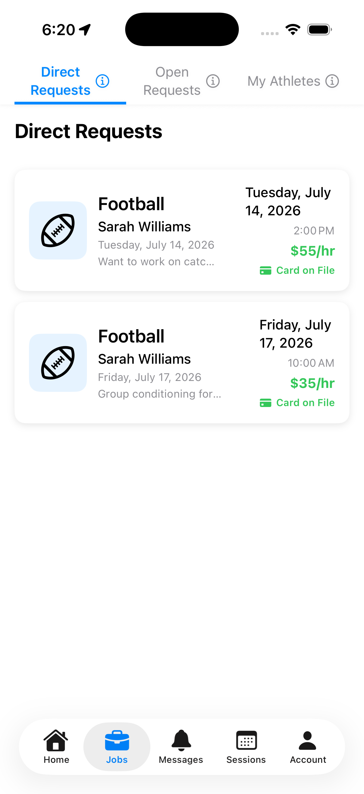
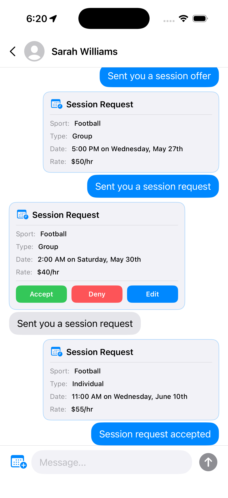
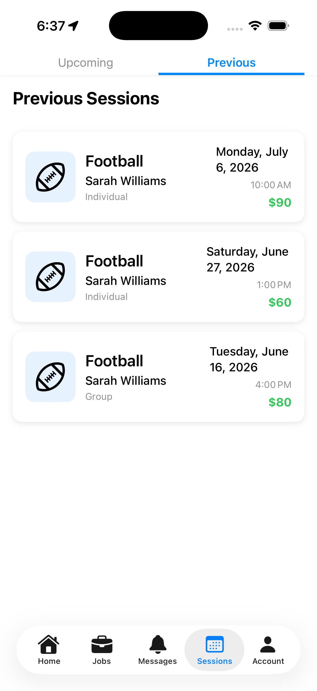

<p align="center">
  
</p>

<h1 align="center">AthLink</h1>

<p align="center">
  <strong>A full-stack iOS marketplace for athletes and private coaches.</strong>
</p>

<p align="center">
  
  
  
  
  
</p>

AthLink is a native SwiftUI application that supports both sides of a coaching marketplace. Athletes can discover coaches, compare profiles, request training sessions, message coaches, and manage bookings. Coaches can respond to direct requests, browse open requests, manage athletes and sessions, configure availability and pricing, and onboard for payouts.

The project includes a working Supabase backend with PostgreSQL, Auth, Storage, Row Level Security, database functions, and Edge Functions. Stripe PaymentSheet and Stripe Connect handle customer payment setup and coach payout onboarding.

## Codebase at a Glance

| Metric | Count |
|:--|--:|
| Application Swift files | 29 |
| Application Swift lines | 11,161 |
| Application Swift nonblank lines | 10,272 |
| Total Swift lines including test targets | 11,270 |
| PostgreSQL application tables | 6 |
| PostgreSQL RPC functions | 6 |
| Documented Edge Function workflows | 8 |
| Product screenshots | 8 |

## Product Walkthrough

<table>
  <tr>
    <td align="center"><strong>Athlete Home</strong><br></td>
    <td align="center"><strong>Coach Discovery</strong><br></td>
    <td align="center"><strong>Coach Profile</strong><br></td>
    <td align="center"><strong>Session Request</strong><br></td>
  </tr>
  <tr>
    <td align="center"><strong>Coach Home</strong><br></td>
    <td align="center"><strong>Direct Requests</strong><br></td>
    <td align="center"><strong>Session Messaging</strong><br></td>
    <td align="center"><strong>Session History</strong><br></td>
  </tr>
</table>

## Features

### Athlete Experience

| Feature | Implementation |
|:--|:--|
| Coach discovery | Location-aware PostgreSQL RPC search with sport, distance, price, name, and availability filters |
| Coach profiles | Pricing, reviews, experience, achievements, availability, cancellation notice, and training locations |
| Session requests | Individual or group requests with date, time, notes, rate, and MapKit location selection |
| Open requests | Athletes can publish a session for nearby coaches to discover |
| Messaging | Supabase-backed conversations with actionable session-request cards embedded in chat |
| Booking management | Upcoming and previous session views, weekly calendar, details, editing, cancellation, and reviews |
| Payments | Stripe PaymentSheet setup flow with persisted customer and payment-method state |

### Coach Experience

| Feature | Implementation |
|:--|:--|
| Coach dashboard | Dual-role account switching, athlete discovery, invitations, referrals, FAQ, and support |
| Job management | Direct Requests, Open Requests, and My Athletes workflows with marketplace filters |
| Session management | Calendar/list views, session details, editing, cancellation, submission, and earnings breakdowns |
| Athlete communication | Conversation history plus session creation, acceptance, denial, and editing in chat |
| Business profile | Sports, positions, pricing, achievements, experience, cancellation terms, locations, and weekly availability |
| Payout onboarding | Stripe Connect account creation, onboarding links, callback handling, and connection-status checks |
| Receipts | PDF receipt generation and iOS share-sheet export for completed sessions |

## Architecture

```text
SwiftUI Views
    |
    v
RootViewObj (@MainActor ObservableObject)
    |-- navigation and dual-role state
    |-- authenticated user and coach profile state
    |-- CoreLocation and MapKit coordination
    |-- async Supabase operations
    |
    +-------------------+-------------------+
    |                   |                   |
    v                   v                   v
Supabase Swift      Stripe iOS         Apple Frameworks
    |                   |                   |
    |                   |-- PaymentSheet    |-- MapKit
    |                   |-- Connect URLs    |-- CoreLocation
    |                   |-- URL callbacks   |-- PhotosUI
    |                                       |-- PDF rendering
    v
Supabase
    |-- Auth
    |-- PostgreSQL + RLS
    |-- Storage
    |-- RPC functions
    +-- Edge Functions
```

`RootViewObj` is the application-level source of truth. It owns the authenticated Supabase client, navigation path, profile state, location services, and role switching. Codable transport models map PostgreSQL rows and JSONB session data into observable SwiftUI state. Network and database work use Swift concurrency with `async`/`await`.

## Backend

The working backend is deployed on Supabase. Every application table is protected by Row Level Security policies, while privileged payment and account operations run through server-side functions. Custom PostgreSQL enum types constrain sport and session-group values.

### PostgreSQL Tables

| Table | Responsibility |
|:--|:--|
| `profiles` | Identity, role, avatar, athlete sessions, coach relationships, Stripe customer state, referrals, credits, and push token |
| `coach_profile` | Coach biography, achievements, experience, availability, rates, sports, positions, cancellation notice, locations, sessions, jobs, athletes, Stripe Connect state, and verification state |
| `messages` | Sender/receiver conversation records, timestamps, message text, embedded JSONB session requests, role context, and resolution state |
| `payments` | One payment record per session with gross amount, coach payout, platform fee, Stripe PaymentIntent/transfer identifiers, status, retries, and timestamps |
| `posted_sessions` | Athlete marketplace requests with sport/type enums, rates, schedule, description, location JSON, and latitude/longitude |
| `reviews` | Coach ratings and written feedback tied to reviewer, coach, and session date |

Database indexes support ordered two-party message queries, sport and rate filtering, and latitude/longitude marketplace searches. Unique session IDs in `payments` provide idempotency at the database layer.

### Database Functions

| Function | Purpose |
|:--|:--|
| `apply_referral` | Validates and applies a referral code during onboarding |
| `clean_expired_posted_sessions` | Removes marketplace requests that are no longer active |
| `get_coach_rating` | Aggregates average rating and review count for a coach |
| `move_past_sessions` | Moves elapsed bookings into the appropriate session history |
| `search_coaches` | Returns location-aware coach results with profile, pricing, and rating data |
| `search_posted_sessions` | Returns filtered open athlete requests for the coach marketplace |

### Edge Functions

The deployed Edge Function layer keeps Stripe credentials and privileged operations off the device:

| Workflow | Responsibility |
|:--|:--|
| Session charging | Creates and tracks the session charge, platform fee, and coach transfer |
| Connect account setup | Creates coach Stripe Connect accounts and onboarding links |
| Connect status | Checks whether payout onboarding has been completed |
| Customer setup | Creates Stripe customers and SetupIntents for PaymentSheet |
| Payment status | Confirms whether an athlete has a usable payment method |
| Push notifications | Sends server-triggered notifications using stored device tokens |
| Stripe redirect | Returns users to AthLink after hosted Stripe onboarding |

## Engineering Skills Demonstrated

- Built a multi-role iOS product with SwiftUI, `NavigationStack`, reusable components, and observable application state.
- Modeled a two-sided marketplace across athlete discovery, booking, messaging, scheduling, reviews, and coach operations.
- Integrated Supabase Auth, PostgreSQL, JSONB data, Storage, RLS, RPC functions, indexes, and serverless Edge Functions.
- Designed secure client/server boundaries so privileged Stripe operations remain on the backend.
- Implemented Stripe PaymentSheet for athletes and Stripe Connect onboarding for coaches.
- Built geospatial search and marketplace filtering with PostgreSQL RPCs, CoreLocation, and MapKit.
- Used Swift concurrency for authenticated loading, writes, profile synchronization, and server-function calls.
- Implemented interactive session state inside chat, including accept, deny, edit, and resolution behavior.
- Generated PDF receipts and integrated native iOS sharing, image selection, location permissions, and URL callbacks.
- Practiced product design for empty states, role-specific onboarding, cancellation policies, pricing, and referral workflows.

## Technology

| Layer | Technology |
|:--|:--|
| Language and UI | Swift, SwiftUI |
| State and concurrency | ObservableObject, `@MainActor`, async/await |
| Backend | Supabase Auth, PostgreSQL, Storage, RPC, Edge Functions |
| Security | Row Level Security and authenticated server-side workflows |
| Payments | Stripe PaymentSheet and Stripe Connect |
| Maps | MapKit, CoreLocation, reverse geocoding |
| Native integrations | PhotosUI, UserNotifications, URL callbacks, PDF rendering |
| Dependency management | Swift Package Manager |

## Local Setup

### Requirements

- Xcode 15 or newer
- iOS 17.5 or newer
- A Supabase project with the documented schema, policies, functions, Storage bucket, and Edge Functions
- Stripe publishable key plus server-side Stripe configuration in Supabase

### Run

1. Clone the project:

   ```bash
   git clone https://github.com/RyanMAubrey/AthLink.git
   cd AthLink
   ```

2. Configure `AthLink/Info.plist` with `SUPABASE_URL`, `SUPABASE_PUBLISHABLE_API_KEY`, and `STRIPE_PUBLISHABLE_API_KEY`.

3. Open `Athlink.xcodeproj`, resolve Swift packages, and run the `AthLink` scheme on an iOS simulator or device.

The production database policies, Stripe secrets, signing credentials, and server environment variables are intentionally managed outside the iOS repository.

## License

This project is proprietary software. See [LICENSE](LICENSE).

Copyright (c) 2025-2026 Ryan Aubrey. All rights reserved.
